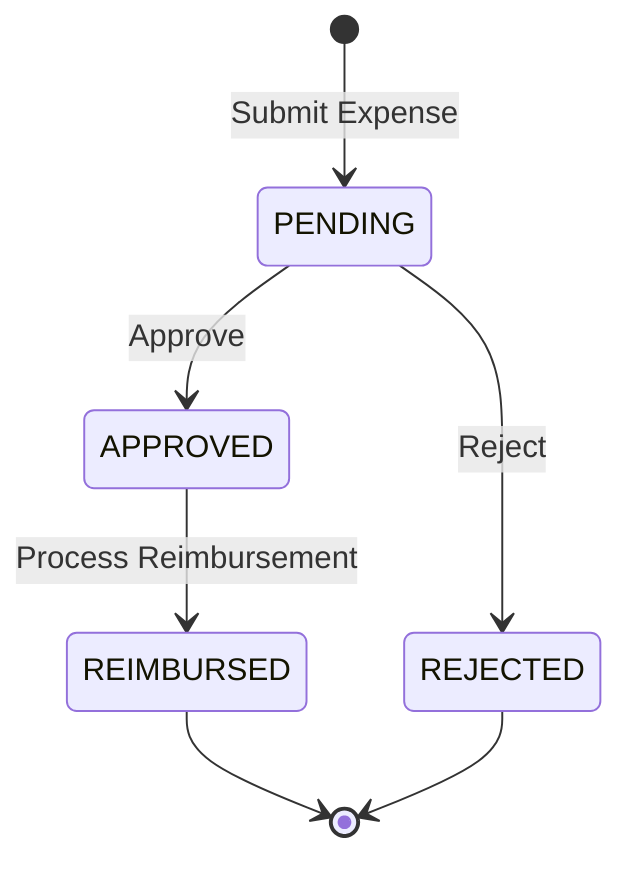

# F09 - Expense Reimbursement Flow

## 🎯 **Visão Geral**
Fluxo completo de reembolso de despesas corporativas, incluindo submissão, upload de recibos, workflow de aprovação e crédito no statement.

## 📋 **SSOT (Single Source of Truth)**
- **Primary SSOT:** `benefits-core` - Expenses, approvals, ledger entries
- **Supporting SSOT:** `support-service` - Advanced approval workflows (future)

## 🗂️ **Campos Exibidos vs Internos**

### **Campos Exibidos ao Usuário (BFF)**
```json
{
  "expenseId": "uuid",
  "title": "Viagem São Paulo",
  "description": "Viagem de negócio",
  "amount": 1250.50,
  "currency": "BRL",
  "category": "TRAVEL",
  "receipts": ["receipt1.jpg", "receipt2.pdf"],
  "status": "PENDING_APPROVAL",
  "submittedAt": "2026-01-18T10:00:00Z",
  "approvedAt": null,
  "approvedBy": null,
  "reimbursedAt": null
}
```

### **Campos Internos (benefits-core)**
```sql
CREATE TABLE expenses (
    id UUID PRIMARY KEY DEFAULT gen_random_uuid(),
    tenant_id UUID NOT NULL REFERENCES tenants(id),
    person_id UUID NOT NULL REFERENCES users(id),
    employer_id UUID NOT NULL REFERENCES employers(id),
    title VARCHAR(255) NOT NULL,
    description TEXT,
    amount DECIMAL(15,2) NOT NULL CHECK (amount > 0),
    currency VARCHAR(3) NOT NULL DEFAULT 'BRL',
    category VARCHAR(50) NOT NULL,
    status VARCHAR(50) NOT NULL DEFAULT 'PENDING',
    submitted_at TIMESTAMP WITH TIME ZONE NOT NULL DEFAULT NOW(),
    approved_at TIMESTAMP WITH TIME ZONE,
    approved_by UUID REFERENCES users(id),
    reimbursed_at TIMESTAMP WITH TIME ZONE,
    created_at TIMESTAMP WITH TIME ZONE NOT NULL DEFAULT NOW(),
    updated_at TIMESTAMP WITH TIME ZONE NOT NULL DEFAULT NOW()
);

CREATE TABLE expense_receipts (
    id UUID PRIMARY KEY DEFAULT gen_random_uuid(),
    expense_id UUID NOT NULL REFERENCES expenses(id) ON DELETE CASCADE,
    filename VARCHAR(255) NOT NULL,
    content_type VARCHAR(100) NOT NULL,
    file_size BIGINT NOT NULL,
    uploaded_at TIMESTAMP WITH TIME ZONE NOT NULL DEFAULT NOW()
);
```

## 🔄 **Workflow de Estados**



## 🏛️ **Autorização por Escopo**

| Role | Permissions |
|------|-------------|
| `user` | Submit expenses, view own expenses |
| `employer_admin` | Approve/reject expenses from team members |
| `tenant_owner` | View all expenses in tenant |
| `admin_ops` | Override approvals, audit all expenses |

## 📡 **API Endpoints**

### **benefits-core Internal Endpoints**
```yaml
POST /internal/expenses
GET /internal/expenses
GET /internal/expenses/{id}
PUT /internal/expenses/{id}/approve
PUT /internal/expenses/{id}/reject
PUT /internal/expenses/{id}/reimburse
POST /internal/expenses/{id}/receipts
```

### **support-bff Public Endpoints**
```yaml
# User endpoints
POST /api/v1/expenses
GET /api/v1/expenses
GET /api/v1/expenses/{id}
POST /api/v1/expenses/{id}/receipts

# Employer admin endpoints
GET /api/v1/employer/expenses/pending
PUT /api/v1/employer/expenses/{id}/approve
PUT /api/v1/employer/expenses/{id}/reject

# Admin endpoints
GET /api/v1/admin/expenses
PUT /api/v1/admin/expenses/{id}/reimburse
```

## 🗃️ **Lineage & Data Flow**

```
User App / Portal → support-bff → benefits-core → Database
                              ↓
                      Async Event → ops-relay → EventBridge
                              ↓
                      Update statement → CREDIT entry
```

## 📝 **Regras de Negócio**

### **Expense Submission**
- Amount > 0
- Category obrigatória
- Pelo menos 1 recibo obrigatório
- Person deve ter employment ativo no employer

### **Approval Workflow**
- Employer admin pode aprovar/rejeitar expenses do próprio employer
- Tenant owner pode ver todas as expenses do tenant
- Admin ops pode sobrescrever approvals

### **Reimbursement**
- Só expenses APPROVED podem ser reimbursed
- Cria CREDIT no ledger do person
- Atualiza status para REIMBURSED

## 🧪 **Cenários de Teste**

### **Cenário 1: Submissão Válida**
```
Given: User com employment ativo
When: Submit expense com recibo
Then: Expense criada com status PENDING
```

### **Cenário 2: Aprovação**
```
Given: Expense PENDING
When: Employer admin aprova
Then: Status muda para APPROVED
```

### **Cenário 3: Reembolso**
```
Given: Expense APPROVED
When: Admin processa reembolso
Then: CREDIT criado no statement
```

### **Cenário 4: Rejeição**
```
Given: Expense PENDING
When: Employer admin rejeita
Then: Status muda para REJECTED
```

## 🔗 **Dependências**
- F05 Credit Batch (ledger structure)
- F06 POS Authorize (wallet/person validation)
- F07 Refund (transaction patterns)
- employer-bff (Feign client para benefits-core)

## 📊 **Métricas & Observabilidade**
- Expense submission rate
- Approval time average
- Reimbursement processing time
- Rejection rate by category

## 🎯 **Critérios de Aceitação**
- ✅ User pode submeter expense com recibo
- ✅ Employer admin pode aprovar/rejeitar
- ✅ Expense APPROVED gera CREDIT no statement
- ✅ Multi-tenancy enforced
- ✅ Idempotency support
- ✅ Async events publicados
- ✅ E2E test coverage